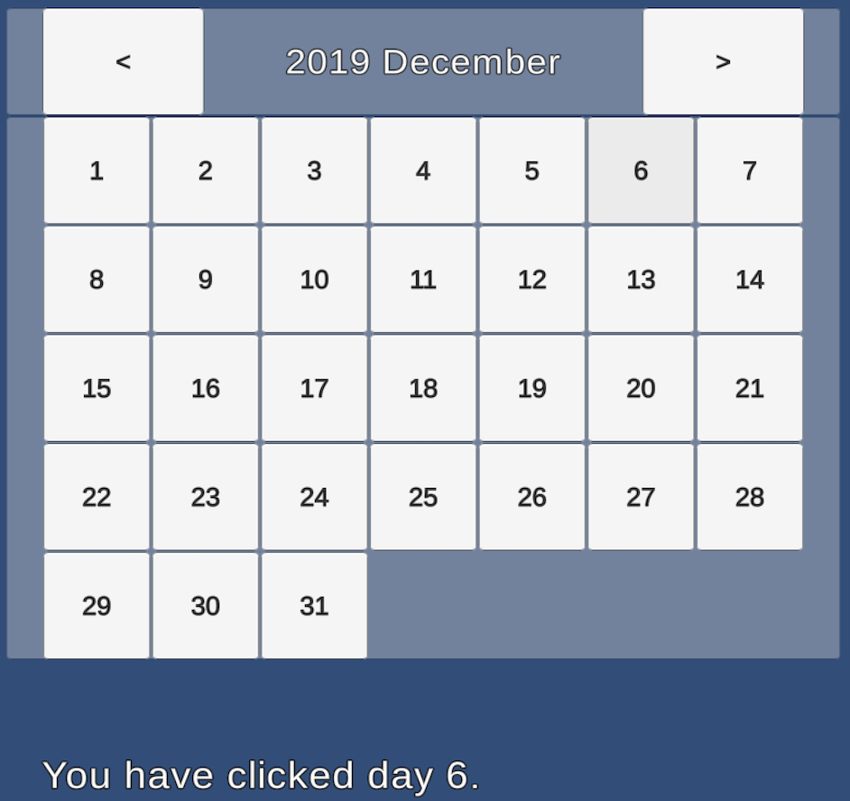

# Simple Unity Calendar
This Unity project shows how to implement a simple calendar.

## Build-in .NET APIs for Calendar implementation
The calendar can be easily implemented by using the following property and method from the DateTime struct.

* [DateTime.DayOfWeek](https://docs.microsoft.com/en-us/dotnet/api/system.dayofweek?view=netframework-4.8) property
* [DateTime.DaysInMonth](https://docs.microsoft.com/en-us/dotnet/api/system.datetime.daysinmonth?view=netframework-4.8) method

The property is to determine the day of week. If the day of a month is set to 1 for a DateTime instance then the property will return the day of week for the 1st day of the month. (Please note that *Sunday* is the first day of the week from the property.)

The method is to determine how many days in the month.

## Logic of implementation
The logic of the calendar is implemented in the Initialize method of BodyManager.cs
So please refer to the source code.

## Screenshot

